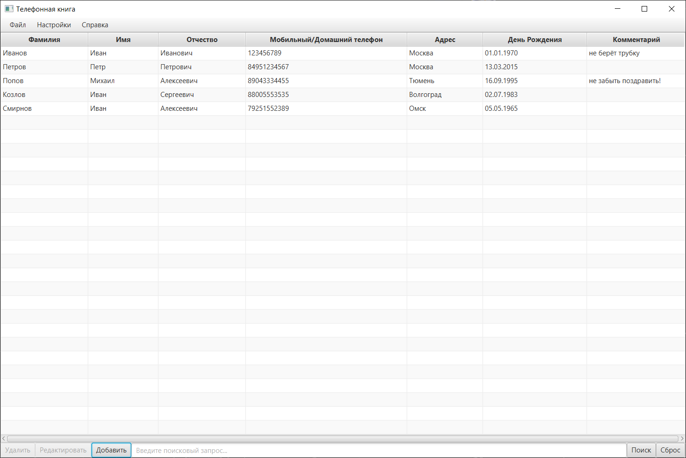
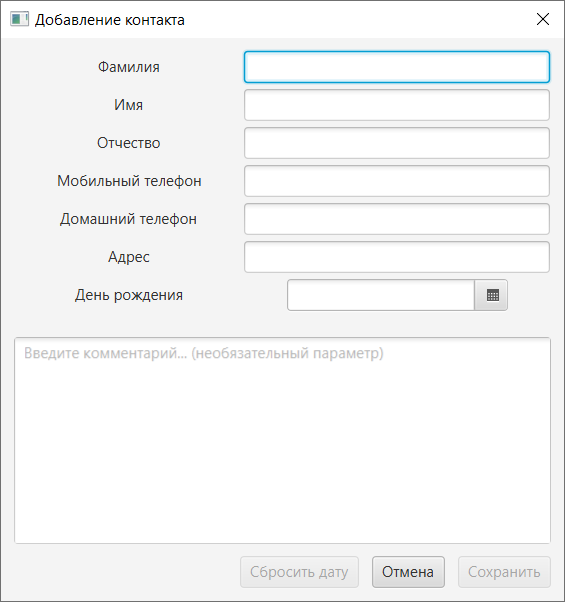
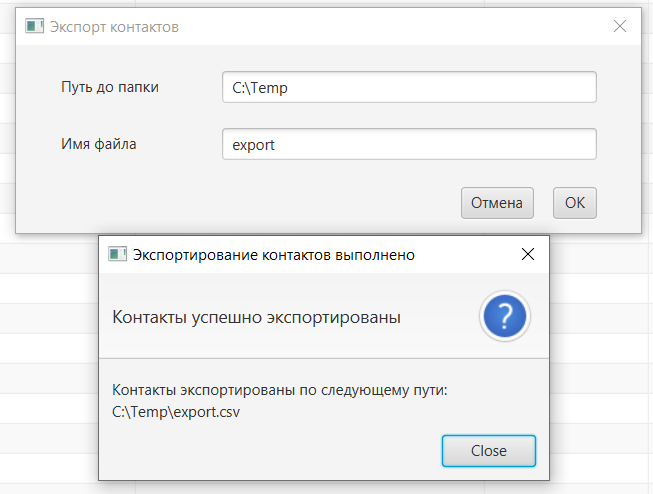

# Derby Phonebook

> 📝 Archived 2023 homework. No longer maintained.

---

**Derby Phonebook** is a desktop phone book app with a JavaFX interface and local storage using Apache Derby.



## Features
* Add, view, edit and delete contact details:
    * Last name
    * First name
    * Middle name
    * Mobile and/or home phone number
    * Address
    * Birthday
    * Notes/comments



* Search contacts by first name, last name, or middle name


* Import and export contacts in .csv format



* Contacts are saved between sessions using a local Apache Derby database.

## Running the Application
Before launching the app, make sure to install [JavaFX SDK 11.0.2](https://gluonhq.com/products/javafx/) and [Apache Derby 10.15.2.0](https://db.apache.org/derby/releases/release-10_15_2_0.cgi). You may need to add their paths to your environment variables.
Java 17 or higher is required.

**Windows:**
```bat
set PATH_TO_FX="path\to\javafx\lib"
set PATH_TO_DERBY="path\to\derby\lib"
java --module-path %PATH_TO_FX%;%PATH_TO_DERBY% --add-modules javafx.controls,javafx.fxml,java.sql -jar DerbyPhonebook-0.1.0.jar
```
