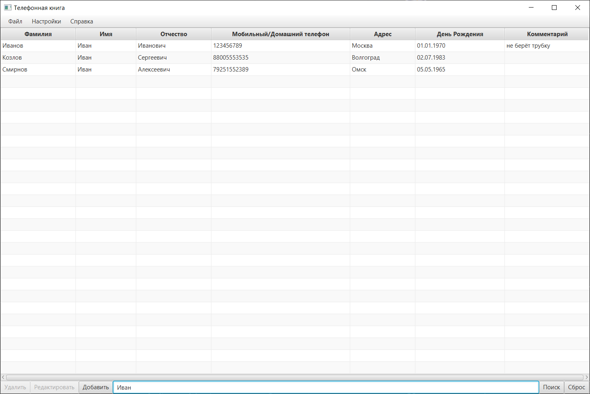

# Derby Phonebook

**Derby Phonebook** - desktop-приложение, представляющее из себя телефонную книгу с графическим интерфейсом на JavaFX и сохранением данных в локальную БД Apache Derby.


## Основные функции
* Добавление, просмотр, редактирование и удаление контакной информации:
    * Фамилия
    * Имя
    * Отчество
    * Мобильный и/или домашний телефон
    * Адрес
    * День рождения
    * Комментарий


* Поиск контакта по фамилии/имени/отчеству



* Импорт и экспорт контактов в формате .csv


* Сохранение контактов между сессиями в локальной базе данных

## Запуск приложения
Перед запуском приложения необходимо установить [JavaFX SDK 11.0.2](https://gluonhq.com/products/javafx/) и [Apache Derby 10.15.2.0](https://db.apache.org/derby/releases/release-10_15_2_0.cgi), при необходимости указав путь к ним в переменных окружения.
Для запуска приложения необходимо иметь установленную версию Java 17 или выше.

**Windows:**
```bat
set PATH_TO_FX="path\to\javafx\lib"
set PATH_TO_DERBY="path\to\derby\lib"
java --module-path %PATH_TO_FX%;%PATH_TO_DERBY% --add-modules javafx.controls,javafx.fxml,java.sql -jar DerbyPhonebook-0.1.0.jar
```
